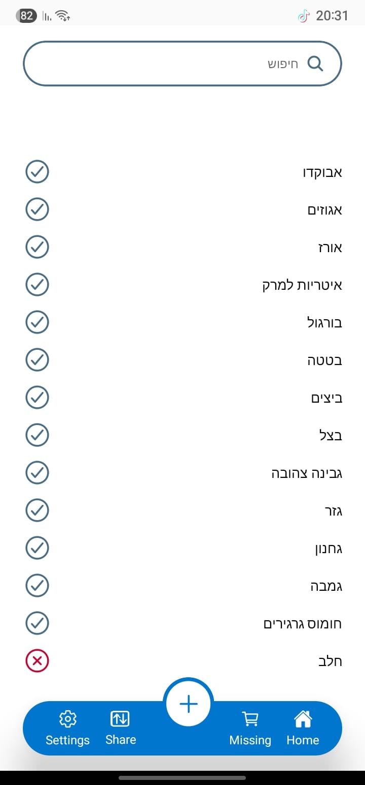
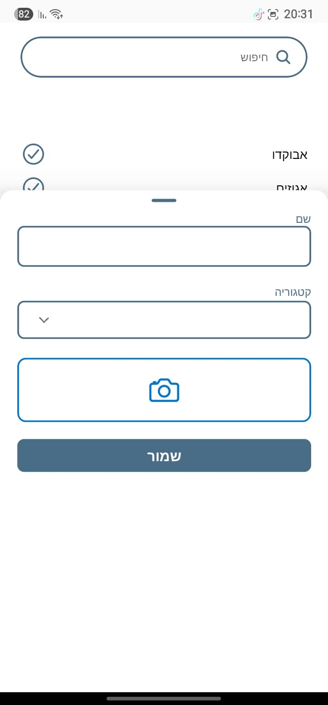
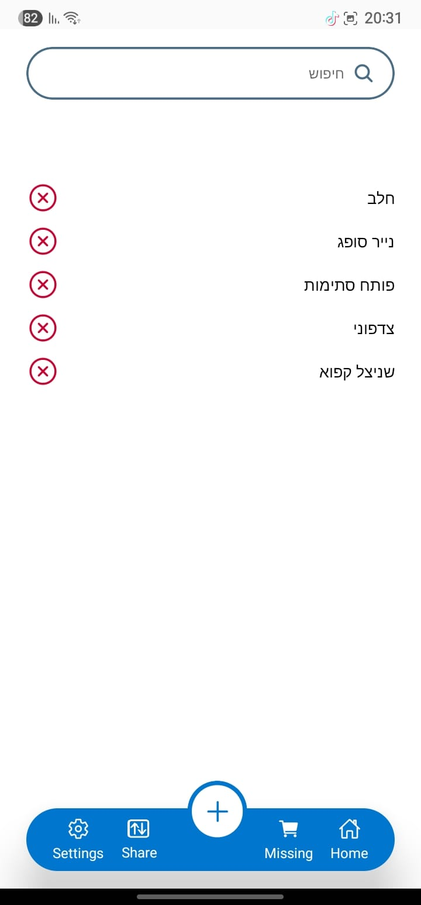
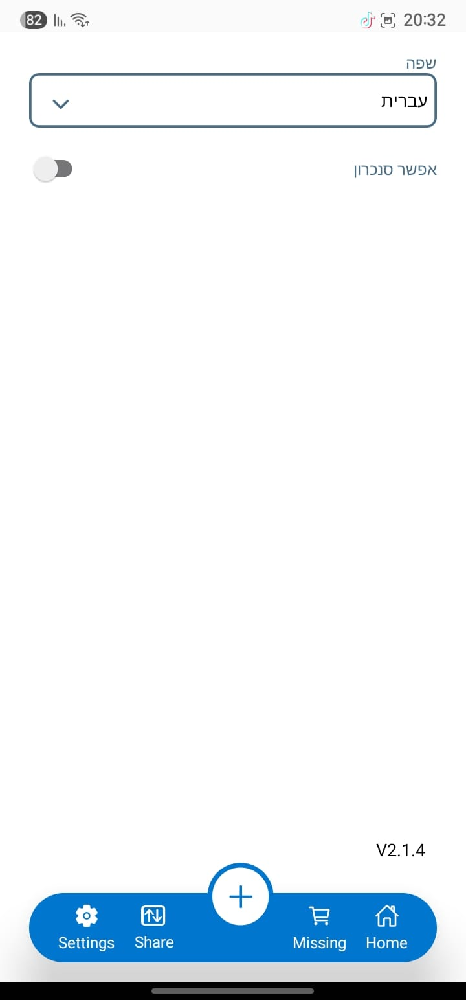

# Shopping List App 🛒

A modern, feature-rich shopping list application built with React Native and Expo. Organize your shopping with categories, images, search functionality, and multi-language support.


## ✨ Features

### 🏠 Core Functionality

- **Smart Shopping Lists**: Create and manage shopping items with categories
- **Missing Items Tracking**: Mark items as missing and track what you need to buy
- **Search & Filter**: Quickly find items with real-time search and category filtering
- **Organized Categories**: Auto-categorize items and filter by categories

### 📸 Visual Features

- **Camera Integration**: Take photos of items directly from the app
- **Gallery Support**: Add images from your photo library
- **Image Optimization**: Efficient image handling with blur hash support
- **Visual Item Recognition**: Attach images to shopping list items

### 🌍 Localization & Accessibility

- **Multi-language Support**: English and Hebrew localization
- **Responsive Design**: Optimized for various screen sizes
- **Modern UI**: Clean, intuitive interface with smooth animations
- **Accessibility**: Built with accessibility best practices

### 🔧 Technical Features

- **Offline-First**: Local storage with MMKV for fast performance
- **Cross-Platform**: Runs on iOS, Android, and Web
- **Analytics**: PostHog integration for usage analytics
- **Type Safety**: Full TypeScript implementation
- **State Management**: Efficient state management with Legend State

### 🚀 Upcoming Features

- **Sharing**: Share shopping lists with friends and family (Coming Soon)
- **Sync**: Cloud synchronization across devices (Coming Soon)

## 📱 Screenshots

| Home Screen                                         | Add Item                                      | Missing Items                                           | Settings                                      |
| --------------------------------------------------- | --------------------------------------------- | ------------------------------------------------------- | --------------------------------------------- |
|  |  |  |  |

The app features a clean, modern interface with:

- **Home Screen**: Complete shopping list with checkable items and search functionality
- **Add Item Form**: Easy item creation with name, category, and camera integration
- **Missing Items**: Dedicated view for items you still need to buy (marked with red X)
- **Settings**: Language selection (English/Hebrew) and sync configuration
- **Multi-language Support**: Full RTL support for Hebrew and other languages
- **Visual Indicators**: Clear checkmarks for completed items, red X for missing items
- **Search & Filter**: Real-time search with Hebrew and English support

## 🛠 Tech Stack

### Frontend

- **React Native** 0.74.2 - Cross-platform mobile development
- **Expo** SDK 51 - Development platform and tooling
- **TypeScript** - Type safety and better developer experience
- **Expo Router** - File-based routing with deep linking support

### State Management & Storage

- **Legend State** - Reactive state management
- **MMKV** - Fast, secure local storage
- **React Hook Form** - Form handling and validation

### UI & Animation

- **React Native Reanimated** - Smooth animations
- **React Native Gesture Handler** - Touch interactions
- **Expo Image** - Optimized image handling
- **React Native SVG** - Vector graphics support

### Camera & Media

- **Expo Camera** - Camera functionality
- **Expo Image Picker** - Gallery access
- **Expo File System** - File management

### Analytics & Monitoring

- **PostHog** - Product analytics and user tracking

## 🚀 Getting Started

### Prerequisites

Before you begin, ensure you have the following installed:

- **Node.js** (version 18 or higher)
- **npm** or **Yarn**
- **Expo CLI**: `npm install -g @expo/cli`
- **Git**

For mobile development:

- **iOS**: Xcode (macOS only)
- **Android**: Android Studio and Android SDK

### Installation

1. **Clone the repository**

   ```bash
   git clone https://github.com/yourusername/shopping-list.git
   cd shopping-list
   ```

2. **Install dependencies**

   ```bash
   # Using npm
   npm install

   # Using Yarn
   yarn install
   ```

3. **Start the development server**
   ```bash
   # Start Expo development server
   npm start
   # or
   yarn start
   ```

### Development Commands

```bash
# Start development server
npm start

# Run on iOS simulator (macOS only)
npm run ios

# Run on Android emulator/device
npm run android

# Run on web browser
npm run web

# Run tests
npm test

# Clean and prebuild
npm run prebuild
```

### Environment Setup

#### iOS Development (macOS only)

1. Install Xcode from the Mac App Store
2. Install Xcode Command Line Tools: `xcode-select --install`
3. Install iOS Simulator

#### Android Development

1. Install Android Studio
2. Set up Android SDK and emulator
3. Configure environment variables:
   ```bash
   export ANDROID_HOME=$HOME/Library/Android/sdk
   export PATH=$PATH:$ANDROID_HOME/emulator
   export PATH=$PATH:$ANDROID_HOME/tools
   export PATH=$PATH:$ANDROID_HOME/platform-tools
   ```

### Running on Physical Devices

1. **Install Expo Go** app on your device:

   - [iOS App Store](https://apps.apple.com/app/expo-go/id982107779)
   - [Google Play Store](https://play.google.com/store/apps/details?id=host.exp.exponent)

2. **Scan QR code** displayed in terminal after running `npm start`

## 🏗 Project Structure

```
shopping-list/
├── app/                    # App screens (Expo Router)
│   ├── index.tsx          # Home screen
│   ├── Missing.tsx        # Missing items screen
│   ├── Settings.tsx       # Settings screen
│   ├── Share.tsx          # Share feature screen
│   └── _layout.tsx        # Root layout
├── components/            # Reusable components
│   ├── ui/               # UI components
│   │   ├── Text.tsx      # Custom text component
│   │   ├── TextInput.tsx # Custom input component
│   │   └── icons/        # Custom icons
│   ├── Camera.tsx        # Camera functionality
│   ├── ItemForm.tsx      # Item creation/editing form
│   └── Nav.tsx           # Navigation component
├── models/               # TypeScript type definitions
│   ├── item.ts          # Item model
│   └── settings.ts      # Settings model
├── utils/               # Utility functions
│   ├── store.ts         # State management
│   ├── theme.ts         # Theme configuration
│   ├── translations.tsx # Localization
│   └── helpers.ts       # Helper functions
├── hooks/               # Custom React hooks
├── assets/              # Static assets (images, fonts)
└── ios/                # iOS native code
```

## 🤝 Contributing

We welcome contributions! Please follow these guidelines:

### Getting Started

1. **Fork the repository** on GitHub
2. **Clone your fork** locally:
   ```bash
   git clone https://github.com/yourusername/shopping-list.git
   ```
3. **Create a feature branch**:
   ```bash
   git checkout -b feature/your-feature-name
   ```

### Development Guidelines

#### Code Style

- Use **TypeScript** for all new code
- Follow **React Native** and **Expo** best practices
- Use **functional components** with hooks
- Implement **proper error handling**
- Write **descriptive commit messages**

#### Component Guidelines

- Use **PascalCase** for component names
- Use **camelCase** for variables and functions
- Keep components **small and focused**
- Use **StyleSheet.create()** for styling
- Implement **proper prop types**

#### File Organization

- Group related files by **feature**
- Use **descriptive file names**
- Keep **imports organized** (external → internal → relative)
- Export components from **index files** when appropriate

### Code Quality

#### Before Submitting

1. **Run tests**: `npm test`
2. **Check TypeScript**: `npx tsc --noEmit`
3. **Format code**: Ensure consistent formatting
4. **Test on multiple platforms**: iOS, Android, and Web if applicable

#### Pull Request Process

1. **Update documentation** if needed
2. **Add tests** for new features
3. **Ensure CI passes**
4. **Request review** from maintainers
5. **Address feedback** promptly

### Reporting Issues

When reporting bugs, please include:

- **Device/Platform** information
- **Steps to reproduce** the issue
- **Expected vs actual** behavior
- **Screenshots** if applicable
- **Error messages** or logs

### Feature Requests

For new features:

- **Check existing issues** first
- **Describe the use case** clearly
- **Explain the expected behavior**
- **Consider implementation complexity**

## 📋 Development Workflow

### Setting Up Development Environment

1. **Install dependencies**:

   ```bash
   npm install
   ```

2. **Start development server**:

   ```bash
   npm start
   ```

3. **Run on desired platform**:

   ```bash
   # iOS (macOS only)
   npm run ios

   # Android
   npm run android

   # Web
   npm run web
   ```

### Testing

```bash
# Run all tests
npm test

# Run tests in watch mode
npm run test:watch

# Run specific test file
npm test -- ItemForm.test.tsx
```

### Building for Production

```bash
# Create production build
npx eas build --platform all

# Create development build
npx eas build --profile development --platform all
```

## 📄 License

This project is licensed under the MIT License - see the [LICENSE](LICENSE) file for details.

## 🙏 Acknowledgments

- **Expo Team** for the amazing development platform
- **React Native Community** for the robust ecosystem
- **Contributors** who help improve this project

## 📞 Support

- **Issues**: [GitHub Issues](https://github.com/yourusername/shopping-list/issues)
- **Discussions**: [GitHub Discussions](https://github.com/yourusername/shopping-list/discussions)

---

**Happy Shopping!** 🛒✨
